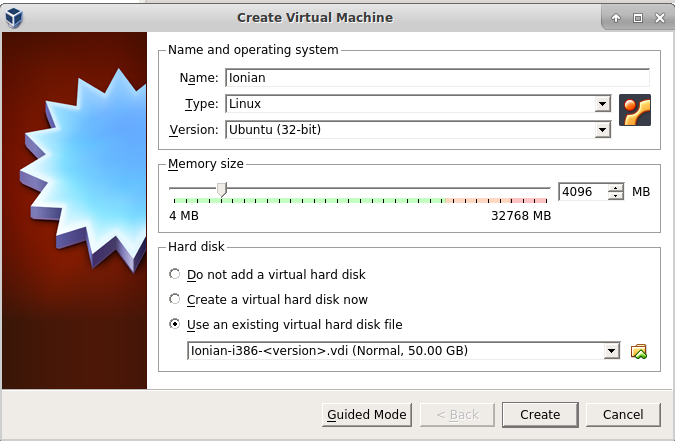

Ionian OS Installation Manual
=============================

Ionian OS is a collection of different Linux Distribution media with ionomy ioncoin software ready installed. It is broken down into 5 different sets of images available at https://github.com/cevap/ionian/releases

1) Ionian ISO -- this is an install-to computer iso image that will install Ubuntu Ionian to a local computer. Available in both i386 and amd64 versions - updated automatically from the master ionomy ppa https://github.com/cevap/ionian/releases/tag/Ionian-iso

2) Ionian USB -- this is meant as a complete copy-and-run solution. With this image you can run directly from the usb medium, also available in i386 and amd64 versions - updated automatically from the master ionomy ppa https://github.com/cevap/ionian/releases/tag/Ionian-usb

3) Ionian VDI -- These images are meant for use in Oracle VIrtualBox environments. Again, i386 and amd64 versions are available - updated automatically from the master ionomy ppa https://github.com/cevap/ionian/releases/tag/Ionian-vdi

4) Ionian OS -- based on Gitian deterministic building https://github.com/cevap/ionian/releases/tag/v8.10

5) Ionian Raspian -- Ready-to-run disk image for Raspberry Pi 3 https://github.com/cevap/ionian/releases/tag/Ionian-Raspian

Virtualbox VDI installation
---------------------------
amd64 and i386 follow the same installation process.  
1) Download the current Ionian vdi (32 or 64 bit) from https://github.com/cevap/ionian/releases/tag/Ionian-vdi
2) Unzip the vdi file that you have just downloaded  
3) Create a new 32 or 64 bit Virtual Machine in Oracle Virtualbox as documented at https://www.virtualbox.org/manual   
4) Select "Use an existing disk file" and select your downloaded VDI as shown below  
  
32 Bit  

  
  
  64 Bit  

  
 5) Start and run your new Ionian OS
  
Ionian USB Installation
-----------------------
Download the current USB image (i386 or amd64) from https://github.com/cevap/ionian/releases/tag/Ionian-usb

1) Windows Install

A) Download rufus (or similar SD writing software) rufus can be downloaded from
  https://rufus.akeo.ie/

B) insert your USB Flash Drive (16 GB or Larger, USB 3.0 Recommended) into an
  unused usb slot

C) double click on your chosen USB writing tool and follow the instructions to install Ionian-&lt;amd64|i386&gt;-&lt;version&gt;.img.xz to your USB Flash Drive.  
(Rufus shown below)    

  
  
  

D) remove the USB Flash Drive replace in your chosen system and reboot (note: first boot will take a short time to configure the ionian user home directory, please be patient).  
 

2) Linux/OSX Install   
 
A) mkusb  

&nbsp;i) install mkusb for your system using the appropriate package manager.

&nbsp;ii) insert your USB Flash Drive (16 GB or Larger, USB3.0 Recommended)) into an
  unused USB slot.  
  
&nbsp;iii) start mkusb and select the Ionian-<amd64|i386\>-<version\>-img.xz file that you downloaded and follow the instructions.

&nbsp;iv) once mkusb has finished you can remove the USB Flash Drive replace in your system and reboot (note: first boot will take a short time to configure the ionian user home directory, please be patient).  
   
B) Using DD from the CLI  

&nbsp;i) insert your USB Flash Drive (16 GB or Larger, USB3.0 Recommended)) into an
  unused USB slot.  
&nbsp;ii) Enter the following command at the CLI prompt in the directory you downloaded the USB image into 
 
"sudo xzcat Ionian-<amd64|i386\>-<version\>.img.xz  | sudo dd of=/dev/sdX bs=4096 status=progress"  

(where X is the letter of your USB Flash Drive  

&nbsp;iii) once dd has finished you can remove the USB Flash Drive replace in your chosen system and reboot (note: first boot will take a short time to configure the ionian user home directory, please be patient).  

Ionian ISO Installation
---------------------- 

Download the current ISO image (i386 or amd64) from https://github.com/cevap/ionian/releases/tag/Ionian-iso and burn the image to a DVD using the appropriate tools (far too many burning tools to mention here)    

Put the DVD that you have created into the DVD drive of the system and select try or install.  
-- note: if "Try Ionian without installing" is selected, ALL changes you make to the system will be lost on reboot.  This is due to the installation being on DVD with no write capabilities.  If needed, you can create a casper-rw usb flash drive to save your changes - this is beyond the scope of this document. 

Ionian for Raspberry Pi 3
-------------------------

Download all parts of Ionian Raspian (either named with bchain-XXXXXXX or no-bchain) from https://github.com/cevap/ionian/tags/Ionian-raspi and unzip them to a directory on the computer you will be writing the images with.

1) Windows Install

    Download rufus (or similar SD writing software) rufus can be downloaded from
    https://rufus.akeo.ie/

    insert your Raspberry Pi 3 SD card (16 GB or Larger) into an
    unused sd card slot or usb slot if using an adapter

    double click on rufus from the download folder you downloaded it to
    and follow the instructions to install ionian-....xz

    remove the SD replace in your Raspberry Pi and reboot your pi

2) Linux/OSX install

    install mkusb for your system using the appropriate package manager

    insert your Raspberry Pi 3 SD card (16 GB or Larger) into an
    unused SD card slot or usb slot if using an adapter

    start mkusb and select the ionian-....xz file that you downloaded
    and follow the instructions

    once mkusb has finished you can remove the SD card, replace it in your
    Raspberry Pi and reboot your pi

Running Ionian

    Login as user ionian password ionian (sudo is unlocked)

    first run iond from the commandline to get an rpc username and password

    enter these into .ioncoin/ioncoin.conf

    you can now run either "systemctl start iond" (headless) or click on the
    icon on the desktop or in the application menu

